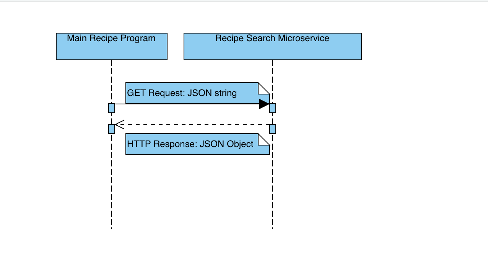

# recipe-search
Microservice that takes input search parameters and returns data from an API matching the correct parameters.
***
## Communication Contract:

In order to **REQUEST** data from this microservice:

    1. Save the program files onto local drive. 

    2. import the requests python library. 

    3. Use HTTP calls to make a GET request. 


**Example**:
```
    params = {"param": json_string}
    microservice_url = {INSERT LOCAL FILE ROUTE HERE}
    response = requests.get(microservice_url, params=params)
```

In order to **RECEIVE** data from this microservice:
```
     response = requests.get(microservice_url, params=params)
     response.json()
```
***

## UML Sequence Diagram:
 